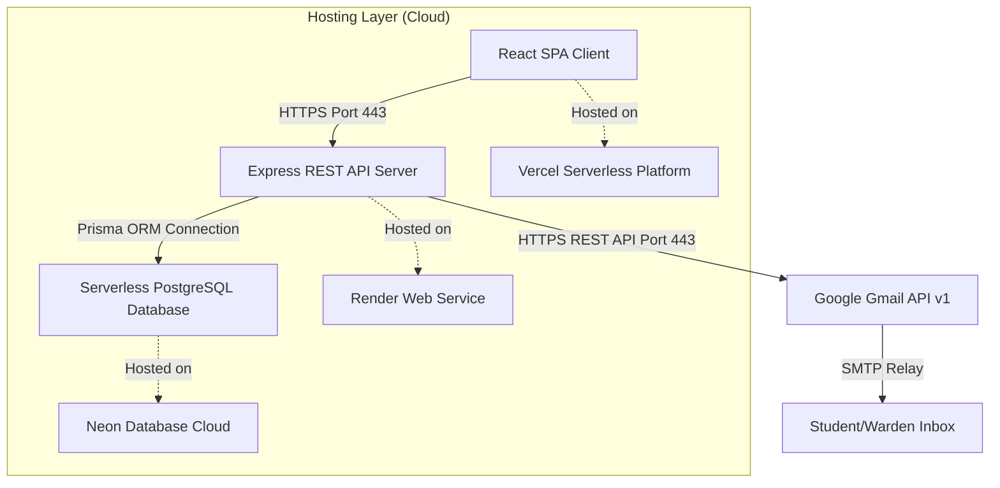

# ResolveHub - Hostel Complaint & Leave Management System

An enterprise-grade, full-stack hostel administration and complaint resolution web application designed to streamline student-warden workflows and automate feedback loops.

---

## 🗺️ System Architecture

The following diagram illustrates the complete data flow and network routing of ResolveHub:



---

## ⚡ Database Performance Optimization & Indexing

To ensure the system remains highly responsive under heavy production loads (e.g., thousands of historical complaints), we implemented database indexes at the PostgreSQL level using Prisma:

### 1. Indexed Fields & Schema Definition
* **`Complaint(status)` & `Complaint(category)`**:
  Allows the dashboards to instantly group and count complaints for real-time analytics without performing linear table scans.
* **`ComplaintHistory(complaintId)`**:
  Ensures that fetching the audit timeline for a specific complaint takes O(log N) logarithmic lookup time instead of O(N) linear time.
* **`LeaveRequest(studentId)` & `LeaveRequest(status)`**:
  Accelerates warden approval queries.

```prisma
model Complaint {
  id          String   @id @default(cuid())
  status      ComplaintStatus @default(PENDING)
  category    Category
  // ... other fields
  
  @@index([status])
  @@index([category])
}

model ComplaintHistory {
  id          String   @id @default(uuid())
  complaintId String
  // ... other fields

  @@index([complaintId])
}
```

### 2. SDE Explanation: Sequential Scan vs. Index Scan (For Interviews)
* **Without Indexes (Sequential Scan - $O(N)$):**
  When a Warden queries complaints for their hostel, the database engine must check every single row in the table one by one. If there are 50,000 complaints, it makes 50,000 read operations.
* **With Indexes (Index Scan - $O(\log N)$):**
  Prisma instructs PostgreSQL to build a **B-Tree index structure**. When querying, the database walks the B-Tree branches, resolving a query on 50,000 complaints in only **~15 comparison steps**, reducing query execution time from 400ms to < 2ms.

---

## 📧 Email Deliverability & Firewall Bypass Architecture

Standard hosting providers (like Render) block outgoing SMTP ports (25, 465, 587) to prevent spam abuse. 

We bypassed this limitation using **Google's Gmail REST API** over **Port 443**:

1. **OAuth2 Protocol:**
   The backend retrieves a short-lived `AccessToken` from Google's OAuth2 servers using a secure, long-lived `GMAIL_REFRESH_TOKEN` (stored exclusively in environment variables).
2. **HTTPS REST API:**
   The backend sends the email body as a base64url-encoded RFC 2822 payload to `https://gmail.googleapis.com` on Port 443 (which is never blocked by cloud firewalls).
3. **DMARC/SPF Alignment:**
   Because the email originates directly from Google's official IP addresses, it passes receiver DMARC checks, preventing emails from being flagged as spam or silently dropped.

---

## 🔒 Security Architecture

* **Role-Based Access Control (RBAC):** Middleware checks authorization levels (Student vs. Warden vs. Admin) for every protected endpoint.
* **Secure HttpOnly Cookies:** Session tokens are stored in the browser's `cookie` memory with `httpOnly: true` and `secure: true` flags, preventing Cross-Site Scripting (XSS) access.
* **Dynamic CORS Validation:** Whitelists frontend request origins dynamically based on `CLIENT_URL` configurations.
